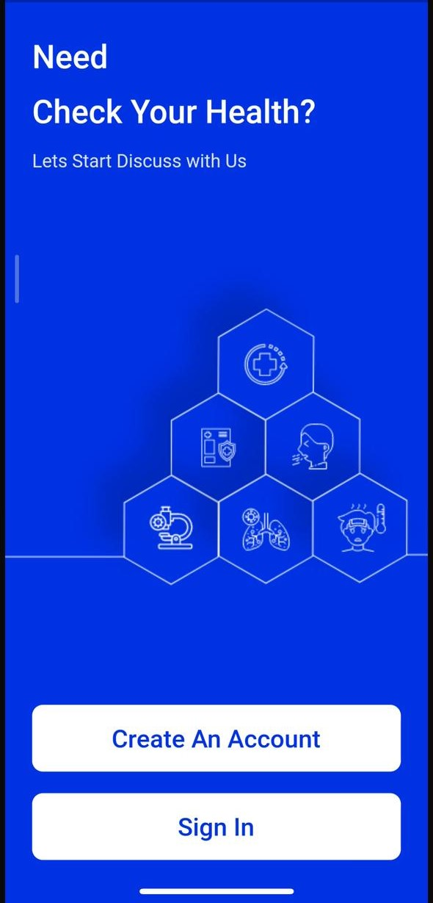
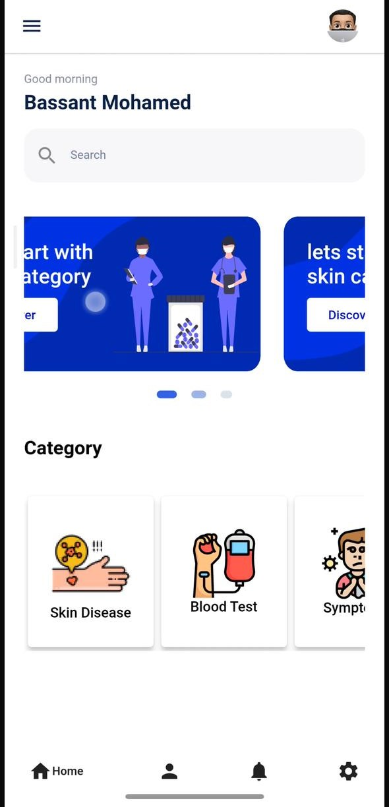

# 🏥 Skin Cancer Detection App

<div align="center">
  
</div>

## 📱 Overview

A Flutter-based mobile application that helps users detect skin cancer through image analysis using machine learning. The app provides a user-friendly interface for uploading skin images, analyzing them, and getting instant results.

## ✨ Features

- 🔐 **User Authentication**
  - Secure login and signup
  - Email verification
  - Password recovery
  - Profile management

- 🖼️ **Skin Cancer Detection**
  - Image upload and analysis
  - Real-time results
  - Multiple skin condition detection
  - Detailed diagnosis information

- 📊 **Additional Health Features**
  - CBC (Complete Blood Count) analysis
  - Kidney disease detection
  - Symptom tracking
  - Medical history

- 🌐 **User Experience**
  - Multi-language support
  - Dark/Light theme
  - Responsive design
  - Intuitive navigation

## 🛠️ Technical Stack

- **Framework:** Flutter
- **State Management:** Cubit & Provider
- **Backend:** Firebase
- **ML Integration:** TensorFlow Lite
- **Authentication:** Firebase Auth

## 📦 Installation

1. Clone the repository
```bash
git clone https://github.com/yourusername/skin_cancer.git
```

2. Install dependencies
```bash
flutter pub get
```

3. Run the app
```bash
flutter run
```

## 🔧 Configuration

1. Set up Firebase:
   - Create a new Firebase project
   - Add your Android/iOS apps
   - Download and add the configuration files
   - Enable Authentication services

2. Configure ML models:
   - Place TensorFlow Lite models in the assets folder
   - Update model paths in the configuration

## 📱 Screenshots

<div align="center">
  
  
</div>

## 🤝 Contributing

Contributions are welcome! Please feel free to submit a Pull Request.

1. Fork the project
2. Create your feature branch (`git checkout -b feature/AmazingFeature`)
3. Commit your changes (`git commit -m 'Add some AmazingFeature'`)
4. Push to the branch (`git push origin feature/AmazingFeature`)
5. Open a Pull Request

## 📄 License

This project is licensed under the MIT License - see the [LICENSE](LICENSE) file for details.

## 👥 Authors

- Your Name - Initial work

## 🙏 Acknowledgments

- TensorFlow team for ML models
- Flutter team for the amazing framework
- Firebase for backend services
- All contributors and supporters

---

<div align="center">
  <p>Made with ❤️ for better healthcare</p>
</div>
